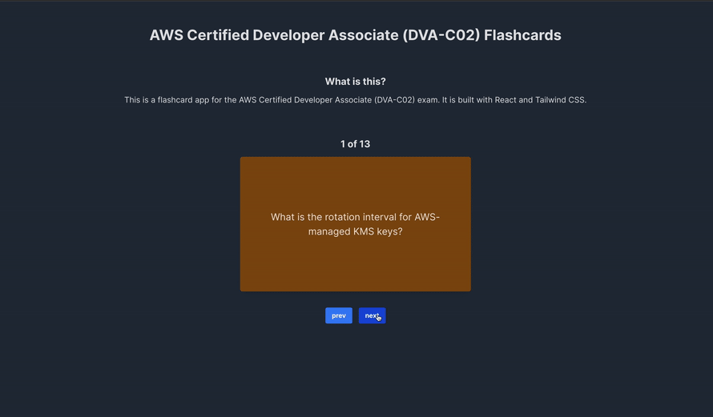

# Flashcards

As a Technical Support Representative (TSR) at CodePath, you are tasked with helping students in the community with their technical issues and questions for the courses they are enrolled in.

To help you understand the community's needs, TSRs are required to build the applications of each course they support. This is a great way to learn the material and empathize with the students.

## Challenge

Your challenge is to build a basic flashcard application using React. The challenges are:
- The title of the card set and some information about it, such as a short description and the total number of cards are displayed
- A single card at a time is displayed, only showing one of the components of the information pair
- Create a list of card pairs (an array of dictionaries where each dictionary contains the question and answer is perfectly fine)
- Clicking on the card shows the corresponding component of the information pair
- Clicking the next button displays a random new card

And there are also some optional challenges:
- Cards contain images in addition to or in place of text
- Cards have different visual styles such as color based on their category

This repository contains the resolution of all those challenges.

## How it looks like

